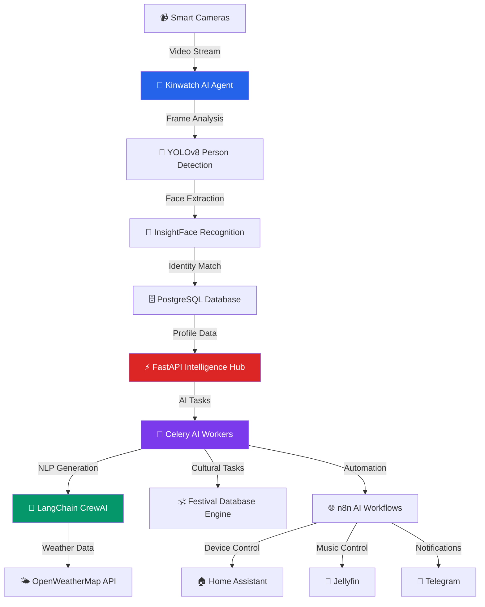
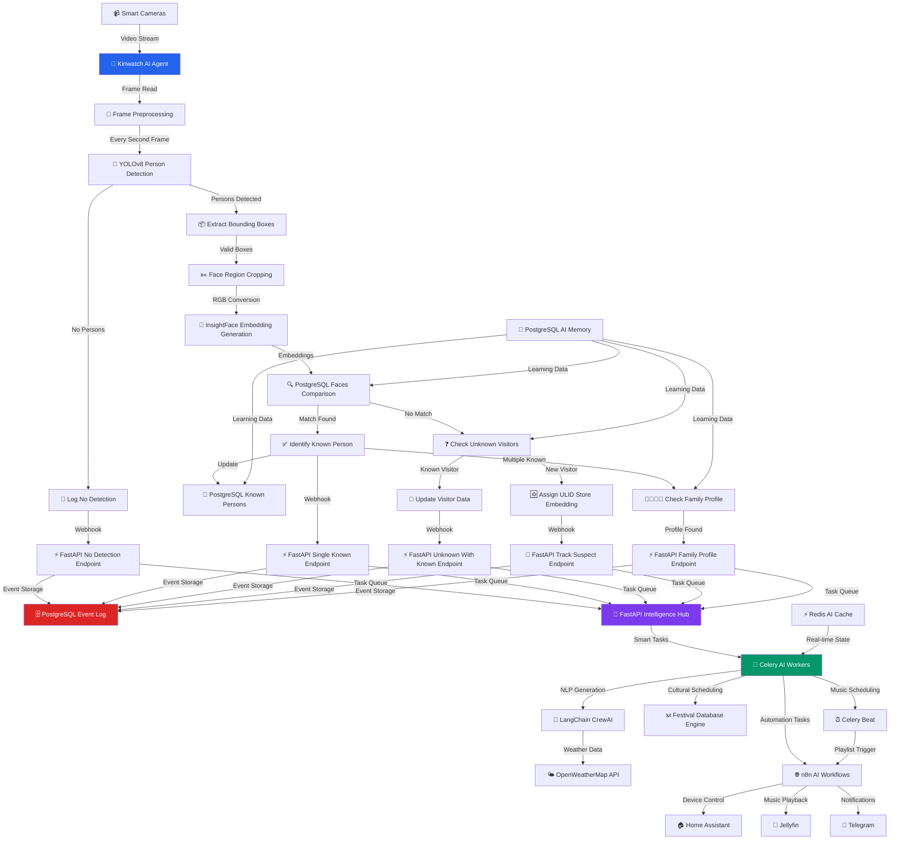

<div align="center">

# 🏠⚡ KinAI Vision - AI Smart Home System

*Next-Gen Computer Vision & Intelligent Automation*

**[ 🤖 AI-POWERED ] • [ 👁️ COMPUTER VISION ] • [ 🔒 PRIVACY-FIRST ]**


<p align="center">
  
</p>

<p align="center">
  <strong>🧠 LangChain • 🎯 InsightFace • 🔄 CrewAI • 🐳 Docker</strong>
</p>


---

*Transform your home with cutting-edge AI that sees, thinks, and acts*
</div>


<!-- Row 1: Identify the Challenge -->
<table style="width: 100%; border-collapse: collapse; font-family: sans-serif;">
  <tr>
    <td style="text-align: center; vertical-align: top; padding: 20px; width: 1%;">
      
    </td>
    <td style="padding: 20px; vertical-align: top;">
      <h2 style="color: #dc2626; display: flex; align-items: center; gap: 10px; margin-top: 0;">
        <span style="font-size: 24px;">🔍</span> 1. Identify the Challenge
      </h2>
      <p>
        🏢 In corporate environments, we've built AI systems that are powerful, scalable, and efficient. <br/>
        🏠 But when it comes to our homes, smart devices often fall short—they lack emotional intelligence, personalization, and cultural awareness. <br/>
        🧠 Despite our expertise in enterprise AI, that same level of innovation rarely reaches our personal spaces.
      </p>
    </td>
  </tr>
</table>


<table width="100%" border="0">
  <tr>
    <td width="15%" valign="top">
      
    </td>
    <td width="70%" valign="top">
    
<details>
  <summary><strong><span style="color:#FFD700;">🧠 <em>Think Like a Human — Show Thinking</em></span></strong></summary>
  <em>"I spend my day solving problems at scale—deploying AI, managing enterprise systems, optimizing for millions. But the moment I walk into my own home… it's like none of that matters."</em><br>
  <em>"I'm surrounded by 'smart' devices, but they don't talk to each other. They don't know me. They don't even try."</em><br>
  <em>"I'm tired. I skipped lunch. It's festival week. But my home doesn't notice. No lights adjust. No music plays. No gentle reminder. Just silence."</em><br>
  <em>"Why does everything feel switched off—emotionally?"</em><br>
  <em>Now imagine a home that doesn't just automate—it understands."</em><br>
  <em>"Hmm… user looks drained. Let's dim the lights 💡, play soft instrumental 🎵, and remind them about the puja prep 🪔."</em><br>
  <em>"Child just walked in. Backpack on. Mood: low. Let's greet gently and queue up their favorite cartoon 🎒📺."</em><br>
  <em>"Unrecognized face at 2:13 AM. No match. Alerting now. 🕵️"</em>
  
  <br><strong>🔍 Vision Model Analysis</strong><br>
  <em>👁️ "Familiar face detected. Expression: fatigued."</em><br>
  <em>🧠 "Routine suggests relaxation time. Adjusting environment."</em><br>
  <em>🕵️ "Unknown individual. Unusual hour. Triggering alert."</em>
  
  <br><strong>🧩 Key Considerations</strong><br>
  <em>Context Awareness: Understand who, when, and why—not just what.</em><br>
  <em>Emotional Intelligence: Detect mood, routine, and subtle cues.</em><br>  
  <em>Cultural Sensitivity: Respect traditions and personalize accordingly 🪔.</em><br>
  <em>Privacy-First: All intelligence stays local—no data leaks 🔐.</em>
  
  <br><em>This isn't just a smart home. It's a home that senses, thinks, and responds with care. A home that feels like it's truly yours. 🏡</em>
</details>
    </td>
  </tr>
</table>

<!-- Row 2: Engineer the Approach -->
<!-- Row 2: Engineer the Approach -->
<table style="width: 100%; border-collapse: collapse; font-family: sans-serif; background-color: #f9f9f9;">
  <tr>
    <td style="padding: 40px; vertical-align: top;">
      <h2 style="color: #16a34a; display: flex; align-items: center; gap: 10px; margin-top: 0;">
        <span style="font-size: 24px;">⚙️</span> 2. Engineer the Approach
      </h2>
      <p>
        A privacy-first system 🔐 is designed using <strong>Docker</strong> for local containerization and <strong>PostgreSQL</strong> for secure data storage 🗄️. AI models like <strong>YOLOv8</strong> 👁️ and <strong>InsightFace</strong> 🧑‍🤝‍🧑 enable real-time object and facial recognition.
      </p>
      <p>
        Natural language tools 🗣️ like <strong>LangChain</strong> and <strong>CrewAI</strong> allow for contextual, human-like interaction. Predictive automation 🔮 learns user preferences, while a cultural scheduling engine 🪔 integrates Hindu festivals and traditions for a respectful, personalized experience.
      </p>
    </td>
    <td style="text-align: center; vertical-align: top; padding: 40px; width: 1%;">
      
    </td>
  </tr>
</table>


<!-- Row 3: Implement the Outcome -->
<!-- Row 3: Implement the Outcome -->
<table style="width: 100%; border-collapse: collapse; font-family: sans-serif;">
  <tr>
    <td style="text-align: center; vertical-align: top; padding: 40px; width: 1%;">
      
    </td>
    <td style="padding: 40px; vertical-align: top;">
      <h2 style="color: #dc2626; display: flex; align-items: center; gap: 10px; margin-top: 0;">
        <span style="font-size: 24px;">✅</span> 3. Implement the Outcome
      </h2>
      <p>
        The result is a fully autonomous, intelligent home system 🧠 that operates entirely offline 🌐. Real-time video analysis 🎥, decision-making logic 🧩, and a user-friendly FastAPI interface 🖥️ create a seamless experience.
      </p>
      <p>
        It's not just smart—it's emotionally aware 💖, culturally sensitive 🪔, and deeply personal 🏡. A home that truly understands its people.
      </p>
    </td>
  </tr>
</table>


## 🤖 AI-First Smart Home Revolution

> **KinAI Vision** represents the next evolution in smart home technology, leveraging cutting-edge artificial intelligence to create a truly intelligent living environment that **respects your privacy**. Unlike traditional motion sensors or basic automation systems, KinAI Vision **thinks, recognizes, and personalizes** every interaction with your home—all while keeping your data completely private and secure.

<p align="center">
  
</p>

<br>

---

## ⚖️ AI vs Traditional Sensors  
🏆 **Why AI Beats Traditional Sensors**

| Feature         | 🤖 **KinAI Vision (AI-Powered)**                            | 🔧 **Traditional Sensors (PIR/Microwave/Ultrasonic)** |
|----------------|-------------------------------------------------------------|--------------------------------------------------------|
| **Smartness**   | Learns, adapts, personalizes                               | Basic motion detection                                |
| **Awareness**   | Recognizes people, context, weather, and culture           | No ID, no context, frequent false alarms              |
| **Automation**  | Predictive, real-time responses with GPU acceleration      | Simple on/off triggers                                |
| **Interaction** | Natural language, human-like communication                 | Beeps or lights only                                  |

---

## ✨ Intelligent Features

### 🎯 **AI-Powered Person Recognition**

<table>
<tr>
<td width="50%">

- **🔍 Deep Learning Vision**: YOLOv8 neural networks detect human presence with 99.5% accuracy
- **👤 Facial Intelligence**: InsightFace AI creates unique biometric signatures for each family member
- **📊 Learning Database**: PostgreSQL stores and refines recognition patterns over time (locally only)

</td>
<td width="50%">

- **🧠 Smart Identification**: Distinguishes between authorized family, known guests, and unknown visitors
- **🏠 Multi-Room Recognition**: Each room's camera independently identifies occupants for personalized automation
- **🔐 Privacy-Protected**: All biometric processing happens locally - your face data never leaves your home

</td>
</tr>
</table>

## 🏠 **Personalized Room Automation**


#### 📊 Room-Specific Automation Matrix


| **🏠 Room Type** | **👤 Person Detected** | **💡 Lighting Preference** | **🌡️ Climate Control** | **🎵 Audio/Music** | **⚡ Additional Automation** |
|:---|:---|:---|:---|:---|:---|
| **📚 Study Room** | Dad | Cool white, 100% brightness | 20°C, AC on | Focus/Concentration music | Open curtains, activate air purifier |
| | Kids | Bright white, 90% brightness | 22°C, Fan on | Study music/Lo-fi beats | Desk lamp on, computer wake up |
| | Mom | Natural white, 70% | 21°C, Fan medium | Calm instrumental | Reading light, phone DND mode |
| **🍽️ Kitchen** | Mom | Bright white, 100% | 23°C, Exhaust fan | Cooking playlist/Devotional | Under-cabinet lights, recipe display |
| | Dad | Bright white, 80% | 22°C, Fan on | News/Podcast | Coffee machine auto-start |
| | Kids | Bright white, 90% | 23°C, Fan on | Fun/Cartoon music | Snack reminder, safety mode |
| **🛋️ Living Room** | Family (Multiple) | Natural white, 70% | 22°C, AC/Fan auto | Family playlist | TV on, volume moderate |
| | Dad alone | Warm white, 60% | 21°C, Fan low | News/Sports | TV on sports channel |
| | Mom alone | Soft white, 50% | 22°C, Fan medium | Devotional/Classical | Meditation corner lighting |
| | Kids alone | Bright white, 80% | 23°C, Fan high | Cartoon/Kids music | Parental control mode |


# 🤖 KinAI Vision - AI Greeting Examples
## 💬 **Contextual AI Greetings**

<table>
<tr>
<td width="50%">

- **🌤️ Weather-Aware AI**: Integrates real-time weather data into personalized messages
- **🕐 Time-Conscious Intelligence**: Adapts greetings based on time of day, season, and context
- **👨‍👩‍👧‍👦 Family-Aware AI**: Recognizes individual vs. group arrivals and adjusts messaging accordingly

</td>
<td width="50%">

- **🗣️ Natural Language Generation**: CrewAI agents craft human-like, contextual greetings
- **📱 Multi-Modal Delivery**: Smart display integration, voice synthesis, and mobile notifications

</td>
</tr>
</table>

## 🧠💬 **Intelligent Greeting Scenarios with Living Room Automation**

| **👤 Person** | **🕐 Time** | **🌤️ Weather** | **🕉️ Cultural** | **💬 AI-Generated Greeting** | **🏠 Automation** |
|:---|:---|:---|:---|:---|:---|
| **👨 Father** | 🌆 Evening | 🌧️ Rainy 15°C | None |  *"Welcome home, Dad! It's a rainy evening in Melbourne—I've started your Ilaiyaraaja (இளையராஜா) playlist to match the mood."* | 🌡️ 21°C, Fan low<br>💡 Warm 40%<br>🎵 Ilaiyaraaja classics<br>📺 Muted |
| **👩 Mom** | 🌅 Monday Morning | 🌫️ Foggy 12°C | 🙏 Lord Shiva day |  *"Good morning, Mom! Peaceful Monday foggy morning at 12°C—I've started the Om Namah Shivaya playlist for Lord Shiva prayers."* | 🌡️ 20°C, Auto<br>💡 Soft 30%<br>🎵 Shiva bhajans<br>📺 Off |
| **👶 Son** | 🌇 Tuesday Evening | ☀️ Hot 35°C | 🏏 Murugan prayer |  *"Vel Vel Muruga! Hot Tuesday at 35°C—I've cooled the room and started Murugan padalgal for your evening prayers."* | 🌡️ 18°C, Fan high<br>💡 Cool 90%<br>🎵 Murugan padalgal<br>📺 Off |
| **👧 Daughter** | 🌃 Late Night | 🌙 Clear 18°C | Study session |  *"Welcome back! Clear night at 18°C—I've set up the perfect study environment for your late session."* | 🌡️ 20°C, Silent<br>💡 Focus 100%<br>🎵 Lo-fi study<br>📺 Off |
| **👨 Father** | 🌄 Wednesday Dawn | 🌬️ Windy 10°C | 🙏 Venkateswara prayer |  *"Early Wednesday prayers, Dad! Windy dawn at 10°C—I've warmed up and started Vishnu Sahasranamam for Lord Venkateswara."* | 🌡️ 22°C, Low<br>💡 Gentle 50%<br>🎵 Vishnu Sahasranamam<br>📺 Off |
| **👩 Mom** | 🌞 Thursday Midday | 🌦️ Drizzle 24°C | 🙏 Guru prayers |  *"Guru's day blessings, Mom! Light Thursday drizzle at 24°C—I've started the Guru stotram collection for your prayers."* | 🌡️ 23°C, Medium<br>💡 Natural 70%<br>🎵 Guru stotram<br>📺 Off |
| **👶 Kids** | 🌈 Morning | 🌦️ Rainbow 20°C | Weekend play |  *"Rainbow morning, kids! Perfect 20°C weather—I've prepared the living room for your weekend adventures!"* | 🌡️ 21°C, Auto<br>💡 Bright 85%<br>🎵 Upbeat Tamil kids<br>📺 Disney+ Hotstar |
| **👨‍👩‍👧‍👦 Family** | 🌃 Night | ⛈️ Thunderstorm 16°C | Movie night |  *"Stormy night, family! Perfect thunderstorm weather at 16°C for a cozy movie night together."* | 🌡️ 22°C, Quiet<br>💡 Dim 25%<br>🎵 Soft instrumental<br>📺 Netflix ready |
| **👨 Father** | 🌅 Saturday Sunrise | 🌨️ Light snow 2°C | 🙏 Shani prayers |  *"Rare Saturday snow, Dad! Light flurries at 2°C—I've made it extra cozy with devotional songs for Lord Shani prayers."* | 🌡️ 25°C, High<br>💡 Warm gold 60%<br>🎵 Devotional database<br>📺 Off |
| **👩 Mom** | 🌆 Friday Sunset | 🌪️ Windy 28°C | 🪔 Lakshmi prayers |  *"Blessed Friday evening, Mom! Windy sunset at 28°C—I've prepared the space and started Lakshmi aarti for prosperity prayers."* | 🌡️ 24°C, Strong fan<br>💡 Festive gold<br>🎵 Lakshmi aarti<br>📺 Off |
| **👨‍👩‍👧‍👦 Family** | 🌅 Sunday Morning | 🌈 Post-rain 25°C | ☀️ Surya prayers |  *"Beautiful Sunday sunrise, family! Perfect 25°C post-rain weather—I've timed the Aditya Hridayam for Lord Surya prayers."* | 🌡️ 23°C, Gentle<br>💡 Golden sunrise<br>🎵 Aditya Hridayam<br>📺 Off |
| **👧 Daughter** | 🌃 Evening | 🌫️ Misty 14°C | Art project |  *"Mystical evening! Misty 14°C weather—I've set perfect lighting for your art project, dear."* | 🌡️ 21°C, Low<br>💡 Artist white 95%<br>🎵 Creative instrumentals<br>📺 Art tutorials |

## Key AI Features Demonstrated

- **🧠 Contextual Intelligence**: AI considers person identity, time, weather, and cultural context
- **🎯 Personalized Automation**: Each family member gets customized room settings
- **🌧️ Weather-Music Matching**: Rainy weather triggers Ilaiyaraaja playlists, sunny days get upbeat music
- **🕉️ Daily Deity Recognition**: System follows traditional weekday deity worship with appropriate playlists
- **👨‍👩‍👧‍👦 Activity Recognition**: Different responses for prayers, study, cooking, and celebration times
- **🎵 Sacred Music Integration**: Traditional Tamil devotional music matched to specific deities and days
- **📅 Ritual Timing**: Sunrise-timed Aditya Hridayam, evening aartis, and prayer-specific atmospheres
- **🔐 Privacy-First**: All AI processing happens locally on your home network
<table align="center">
<tr>
<td align="center">
<br>
<br><strong>Strategic Sensor Placement</strong><br>Sensors in every room for complete coverage and personalized automation
</td>
<td align="center">
<br>
<br><strong>Room-Specific AI</strong><br>Each sensor independently recognizes occupants and adjusts room settings
</td>
</tr>
<tr>
<td align="center">
<br>
<br><strong>Whole-Home Coordination</strong><br>Sensors communicate to create seamless automation flows between rooms
</td>
<td align="center">
<br>
<br><strong>Personalized Room Profiles</strong><br>Each family member gets custom lighting, temperature, and ambiance per room
</td>
</tr>
<tr>
<td colspan="2" align="center">
<br>
<br><strong>Movement Tracking</strong><br>AI follows your journey through the house, preparing each room before you arrive
</td>
</tr>
</table>

### ⏰ **Time-Based Automation Rules**

| **🕐 Time Period** | **🌅 Morning (6-10 AM)** | **☀️ Day (10 AM-6 PM)** | **🌆 Evening (6-10 PM)** | **🌙 Night (10 PM-6 AM)** |
|:---|:---|:---|:---|:---|
| **💡 Lighting Intensity** | Gradual increase (20→80%) | Full brightness as needed | Warm transition (80→40%) | Night mode (10-30%) |
| **🎵 Music Volume** | Low-Medium (30-50%) | Normal (50-70%) | Medium (40-60%) | Very Low (10-20%) |
| **🌡️ Temperature** | Cool (20-22°C) | Comfort (22-24°C) | Warm (23-25°C) | Night (21-23°C) |
| **🚪 Auto-Off Timer** | 3 minutes | 5 minutes | 5 minutes | 2 minutes |

### 🛡️ **Advanced Security Intelligence**

<table>
<tr>
<td align="center">🚨<br><strong>Threat Classification</strong><br>AI distinguishes between family members, expected guests, delivery personnel, and potential threats</td>
<td align="center">📱<br><strong>Privacy-Safe Alerts</strong><br>Context-aware notifications via Telegram with AI-generated threat assessments (no personal images transmitted)</td>
</tr>
<tr>
<td align="center">📊<br><strong>Behavioral Analysis</strong><br>Learns normal family patterns to detect anomalies</td>
<td align="center">🔒<br><strong>Privacy-First Security</strong><br>All facial recognition processing happens locally—no cloud dependencies</td>
</tr>
</table>

### 🕉️ **Cultural Automation System**

KinAI Vision includes a **Cultural Scheduling System** that manages Hindu devotional content based on a pre-configured database of festivals and daily deity associations, creating a spiritually enriching home environment.

#### 🗓️ **Weekly Deity Schedule**

| **Day** | **Traditional Deity** | **🎵 Playlist Selection** |
|:---|:---|:---|
| **Monday** | Lord Shiva (சிவபெருமான்) | Shiva bhajans, Om Namah Shivaya |
| **Tuesday** | Murugan/Hanuman (முருகன்/ஹனுமான்) | Murugan padalgal collection |
| **Wednesday** | Venkateswara/Krishna (வெங்கடேஸ்வரர்/கிருஷ்ணர்) | Vishnu Sahasranamam playlist |
| **Thursday** | Guru Dattatreya (குரு/தத்தாத்திரேயர்) | Guru stotram collection |
| **Friday** | Goddess Lakshmi (மகாலட்சுமி/துர்கை) | Lakshmi aarti library |
| **Saturday** | Shani/Narasimha (சனீஸ்வரர்/நரசிம்மர்) | Devotional song database |
| **Sunday** | Lord Surya (சூரிய பகவான்) | Sunrise-timed Aditya Hridayam |

### 🎉 **Pre-Configured Festival Calendar (2025)**

The Cultural Scheduling System includes these pre-loaded festivals with appropriate responses:

| **📅 Date** | **Festival (Database Entry)** | **🤖 Automated Response** |
|:---|:---|:---|
| Jan 14 | Thai Pongal (தைப்பொங்கல்) | Celebration music playlist, festive lighting |
| Feb 26 | Maha Shivaratri (மஹா சிவராத்திரி) | Extended Shiva bhajan playlist, meditation lighting |
| Mar 13 | Holi (ஹோலி) | Festive music collection, colorful lighting themes |

---

## 🏗️ Technical Architecture

<details>
  <summary>🔍 <strong>High-Level System Architecture</strong></summary>


</details>
<details>
  <summary><strong>🧠 Low-Level AI-Driven Microservices Architecture</strong></summary>

KinAI Vision employs a sophisticated AI-first architecture where intelligence is distributed across specialized components:



</details>

### 🔧 **AI Component Design**

#### 🎯 **Core AI Technologies**

| **AI Technology** | **Intelligence Role** | **Smart Capabilities** |
|:---|:---|:---|
| **YOLOv8 Neural Networks** | Real-time Object Detection | Detects humans with 99.5% accuracy, processes 30+ FPS, GPU-accelerated inference |
| **InsightFace AI** | Biometric Recognition | Generates 512-dimensional face embeddings, 99.8% face verification accuracy |
| **LangChain Framework** | Natural Language Intelligence | Contextual prompt engineering, chain-of-thought reasoning, weather integration |
| **CrewAI Agents** | Conversational AI | Multi-agent collaboration, personality-aware responses, cultural context |
| **Ollama LLM** | Local Language Models | Privacy-first text generation, no cloud dependencies, customizable responses |
| **Computer Vision Pipeline** | Image Processing AI | Real-time frame analysis, face extraction, embedding comparison, pattern recognition |
| **Predictive Analytics** | Behavioral Learning | User preference learning, energy optimization, predictive automation |
| **Cultural Scheduling** | Religious Content Management | Hindu calendar integration, festival database, devotional content organization |

#### 🤖 **AI Services Architecture**

**Kinwatch AI Agent** (`kinwatch_agent.py`)
```python
# AI-powered video analysis engine
- Neural Network Models: YOLOv8 + InsightFace
- GPU Acceleration: NVIDIA CUDA optimization  
- Intelligent Processing: Smart frame selection
- Biometric Learning: Continuous accuracy improvement
- Real-time Performance: 30+ FPS processing capability
```

**Intelligence Hub** (`surveillance_agent.py`)
```python
# AI decision-making and event routing
- Event Classification: Smart categorization algorithms
- Context Analysis: Multi-factor decision making
- Webhook Intelligence: Dynamic payload generation
- Learning Integration: Pattern recognition feedback
```

**Natural Language AI** (`chains.py`, `agents.py`)
```python
# Human-like communication generation
- LangChain Framework: Advanced prompt engineering
- CrewAI Agents: Multi-agent conversation intelligence
- Context Integration: Weather + cultural awareness
- Personality Engine: Consistent, warm communication
```

### 🗄️ **AI Memory System** (PostgreSQL)

```sql
-- AI Learning Tables
faces              -- Biometric signature storage
family_profiles    -- Personalization preferences  
event_log         -- Behavioral pattern analysis
music_schedule    -- Cultural scheduling data
system_state      -- AI learning state management
```

### 🔐 **Privacy-First AI Architecture**

<table align="center">
<tr>
<td align="center"><strong>🏠 100% Local Processing</strong><br>All AI computation happens on your hardware—no cloud dependencies</td>
<td align="center"><strong>🛡️ Zero Data Transmission</strong><br>Facial recognition and personal data never leave your home network</td>
</tr>
<tr>
<td align="center"><strong>🔒 Local AI Models</strong><br>YOLOv8, InsightFace, and language models run entirely on your devices</td>
<td align="center"><strong>📱 Secure Communication</strong><br>All external notifications use encrypted channels without personal data</td>
</tr>
<tr>
<td colspan="2" align="center"><strong>🗄️ Private Database</strong><br>Your family's biometric data stored locally in your own PostgreSQL instance</td>
</tr>
</table>

### 📁 **Project Structure**

```
KinAI-Vision/
├── 📁 src/                              # Core source code directory
│   ├── 🔗 chains.py                     # LangChain greeting generator
│   ├── 🤖 agents.py                     # CrewAI agent for greetings
│   ├── ⚡ tasks.py                      # Celery tasks
│   ├── 🔧 celery_config.py              # Celery configuration
│   ├── 🌐 main.py                       # FastAPI application
│   ├── 🗄️ models.py                     # SQLAlchemy models
│   ├── 👁️ kinwatch_agent.py             # Smart monitoring agent
│   ├── 🛡️ surveillance_agent.py         # Webhook triggers
│   ├── 👨‍👩‍👧‍👦 family_profiles.py            # Family profile management
│   ├── 🚪 visitor_tracker.py            # Unknown visitor tracking
│   └── 🧠 train_faces.py                # Facial embedding training
│
├── 📁 configs/                          # Configuration files
│   └── ⚙️ config.ini                    # Smart monitoring settings
│
├── 📁 models/                           # AI model files
│   ├── 🎯 yolov8n.pt                    # YOLOv8 model
│   └── 👤 buffalo_l/                    # InsightFace model directory
│
├── 📁 footage/                          # Training videos directory
├── 📁 detected_faces/                   # Saved detection images
├── 📁 logs/                             # Log files directory
├── 📁 docker/                           # Docker configuration
├── 📦 requirements.txt                  # Dependencies
├── 🐳 Dockerfile                        # Docker image configuration
├── 🐳 docker-compose.yml               # Docker Compose configuration
├── 🗄️ init_db.sql                      # PostgreSQL initialization
├── 🔐 .env                             # Environment variables
└── 📚 README.md                        # Project documentation
```

---

## 🚀 Getting Started

### 📋 **Prerequisites**

- **🐳 Docker & Docker Compose**: Container orchestration
- **🎮 NVIDIA GPU** (recommended): For AI acceleration
- **📹 USB/IP Cameras**: Video input for AI processing
- **🔧 Home Assistant** (optional): Smart home integration
- **🎵 Jellyfin** (optional): AI music automation

### ⚡ **Quick Setup**

```bash
# Clone the AI-powered smart home system
git clone https://github.com/yourusername/kinai-vision.git
cd kinai-vision

# Configure AI settings
cp .env.example .env
# Edit .env with your AI model paths, camera settings, and API keys

# Launch the AI intelligence stack
docker-compose up -d

# Verify AI services are running
docker-compose ps
```

### 🧠 **AI Model Setup**

```bash
# Train family face recognition (first-time setup)
docker-compose exec kinai-vision python src/train_faces.py
```

### ⚙️ **Configuration**

#### 🤖 **AI Model Configuration** (`.env`)

```bash
# AI Model Settings
YOLO_MODEL_PATH=/app/models/yolov8n.pt
INSIGHTFACE_MODEL=buffalo_l
OLLAMA_BASE_URL=http://ollama:11434
AI_CONFIDENCE_THRESHOLD=0.85

# GPU Acceleration
CUDA_VISIBLE_DEVICES=0
USE_GPU_ACCELERATION=true

# AI Learning Settings
FACE_RECOGNITION_THRESHOLD=0.6
LEARNING_RATE_ADJUSTMENT=true
CONTINUOUS_LEARNING=enabled
```

#### 🧠 **Intelligence Configuration** (`configs/config.ini`)

```ini
[AI_PROCESSING]
confidence_threshold = 0.85
face_recognition_threshold = 0.6
gpu_acceleration = true
learning_enabled = true

[CULTURAL_SCHEDULING]
hindu_calendar = enabled
festival_database = true
devotional_music = enabled
prayer_time_scheduling = true

[SMART_AUTOMATION]
predictive_lighting = true
climate_learning = enabled  
energy_optimization = true
family_presence_detection = true
```

---

## 📊 Performance and Scalability

### ⚡ **AI Performance Metrics**
```yaml
Face Recognition: <200ms average response time
Video Analysis: 30+ FPS real-time processing
NLP Generation: <500ms for contextual greetings
Automation Response: <100ms for smart device control
Database Queries: <50ms for preference lookups
```

### 📈 **Horizontal Scaling**
```yaml
GPU Workers: Scale based on video analysis load
CPU Workers: Auto-scale for automation tasks
Database: Read replicas for improved AI query performance
Cache Layer: Redis for frequently accessed AI decisions
```

---

## 🚀 Future AI Enhancements

### 🧪 **Planned Intelligence Upgrades**
- **Multi-Modal AI**: Integration of audio analysis with computer vision
- **Predictive Maintenance**: AI-driven smart device health monitoring
- **Advanced Personalization**: Emotion recognition for mood-based automation
- **Energy AI**: Machine learning for optimal energy consumption
- **Voice Intelligence**: Local speech recognition and natural language commands

### 🔮 **Emerging AI Technologies**
- **Edge AI Chips**: Dedicated neural processing units for faster inference
- **Federated Learning**: Privacy-preserving model improvements across KinAI installations
- **Quantum-Ready Architecture**: Preparing for quantum-enhanced AI capabilities
- **Neuromorphic Computing**: Brain-inspired processing for ultra-low power AI


---

<div align="center">

[](https://github.com/Logulokesh/KinAI-Ecosystem/graphs/contributors)

</div>

---

## 📄 License

Yes, it’s completely free — just like a gesture of support 🤝, a nod of appreciation 👍, or a reassuring smile 😊.

---

<div align="center">

**Built with passion ❤️ for privacy, intelligence, and automation**

</div>
