<div align="center">

# 🏠⚡ AI Smart Home

</div>

## *Next-Gen Computer Vision & Intelligent Automation*

<p align="center"><strong>[ 🤖 AI-POWERED ] • [ 👁️ COMPUTER VISION ] • [ 🔒 PRIVACY-FIRST ]</strong></p>


**🧠 LangChain • 🎯 InsightFace • 🔄 CrewAI • 🐳 Docker**

---

*Transform your home with cutting-edge AI that sees, thinks, and acts*
</div>

<!-- Row 1: Identify the Challenge -->
<table style="width: 100%; border-collapse: collapse; font-family: sans-serif;">
  <tr>
    <td style="width: 200px; text-align: center; vertical-align: top; padding: 40px;">
      
    </td>
    <td style="padding: 40px; vertical-align: top;">
      <h2 style="color: #dc2626; display: flex; align-items: center; gap: 10px; margin-top: 0;">
        <span style="font-size: 24px;">🔍</span> 1. Identify the Challenge
      </h2>
      <p>
        🏢 In corporate environments, we've built AI systems that are powerful, scalable, and efficient. <br/>
        🏠 But when it comes to our homes, smart devices often fall short—they lack emotional intelligence, personalization, and cultural awareness. <br/>
        🧠 Despite our expertise in enterprise AI, that same level of innovation rarely reaches our personal spaces.
      </p>
    </td>
  </tr>
</table>

<details>
  <summary><strong><span style="color:#FFD700;">🧠 <em>Thinking Like a Real Human Agent</em></span></strong></summary>

  <em>"I spend my day solving problems at scale—deploying AI, managing enterprise systems, optimizing for millions. But the moment I walk into my own home… it's like none of that matters."</em>
  <em>"I'm surrounded by 'smart' devices, but they don't talk to each other. They don't know me. They don't even try."</em>
  <em>"I'm tired. I skipped lunch. It's festival week. But my home doesn't notice. No lights adjust. No music plays. No gentle reminder. Just silence."</em>
  <em>"Why does everything feel switched off—emotionally?"</em>
  <em>Now imagine a home that doesn't just automate—it understands."</em>
  <em>"Hmm… user looks drained. Let's dim the lights 💡, play soft instrumental 🎵, and remind them about the puja prep 🪔."</em>
  <em>"Child just walked in. Backpack on. Mood: low. Let's greet gently and queue up their favorite cartoon 🎒📺."</em>
  <em>"Unrecognized face at 2:13 AM. No match. Alerting now. 🕵️"</em>

  <br><br><em><strong>🔍 Vision Model Analysis</strong></em>
  <em>👁️ "Familiar face detected. Expression: fatigued."</em>
  <em>🧠 "Routine suggests relaxation time. Adjusting environment."</em>
  <em>🕵️ "Unknown individual. Unusual hour. Triggering alert."</em>

  <br><br><em><strong>🧩 Key Considerations</strong></em>
  <em>Context Awareness: Understand who, when, and why—not just what.</em>
  <em>Emotional Intelligence: Detect mood, routine, and subtle cues.</em>
  <em>Cultural Sensitivity: Respect traditions and personalize accordingly 🪔.</em>
  <em>Privacy-First: All intelligence stays local—no data leaks 🔐.</em>

  <br><br><em><strong>✅ Conclusion</strong></em>
  <em>This isn't just a smart home. It's a home that senses, thinks, and responds with care. A home that feels like it's truly yours. 🏡</em>
</details>

<!-- Row 2: Engineer the Approach -->
<table style="width: 100%; border-collapse: collapse; font-family: sans-serif; background-color: #f9f9f9;">
  <tr>
    <td style="padding: 40px; vertical-align: top;">
      <h2 style="color: #16a34a; display: flex; align-items: center; gap: 10px; margin-top: 0;">
        <span style="font-size: 24px;">⚙️</span> 2. Engineer the Approach
      </h2>
      <p>
        A privacy-first system 🔐 is designed using <strong>Docker</strong> for local containerization and <strong>PostgreSQL</strong> for secure data storage 🗄️. AI models like <strong>YOLOv8</strong> 👁️ and <strong>InsightFace</strong> 🧑‍🤝‍🧑 enable real-time object and facial recognition.
      </p>
      <p>
        Natural language tools 🗣️ like <strong>LangChain</strong> and <strong>CrewAI</strong> allow for contextual, human-like interaction. Predictive automation 🔮 learns user preferences, while a cultural scheduling engine 🪔 integrates Hindu festivals and traditions for a respectful, personalized experience.
      </p>
    </td>
    <td style="width: 200px; text-align: center; vertical-align: top; padding: 40px;">
      
    </td>
  </tr>
</table>

<!-- Row 3: Implement the Outcome -->
<table style="width: 100%; border-collapse: collapse; font-family: sans-serif;">
  <tr>
    <td style="width: 200px; text-align: center; vertical-align: top; padding: 40px;">
      
    </td>
    <td style="padding: 40px; vertical-align: top;">
      <h2 style="color: #dc2626; display: flex; align-items: center; gap: 10px; margin-top: 0;">
        <span style="font-size: 24px;">✅</span> 3. Implement the Outcome
      </h2>
      <p>
        The result is a fully autonomous, intelligent home system 🧠 that operates entirely offline 🌐. Real-time video analysis 🎥, decision-making logic 🧩, and a user-friendly FastAPI interface 🖥️ create a seamless experience.
      </p>
      <p>
        It's not just smart—it's emotionally aware 💖, culturally sensitive 🪔, and deeply personal 🏡. A home that truly understands its people.
      </p>
    </td>
  </tr>
</table>


## 🤖 AI-First Smart Home Revolution

> **KinAI Vision** represents the next evolution in smart home technology, leveraging cutting-edge artificial intelligence to create a truly intelligent living environment that **respects your privacy**. Unlike traditional motion sensors or basic automation systems, KinAI Vision **thinks, recognizes, and personalizes** every interaction with your home—all while keeping your data completely private and secure.

<p align="center">
  
</p>

<br>

<div align="center">

### 🔐 **Privacy-First AI Architecture**

</div>

<table align="center">
<tr>
<td align="center"><strong>🏠 100% Local Processing</strong><br>All AI computation happens on your hardware—no cloud dependencies</td>
<td align="center"><strong>🛡️ Zero Data Transmission</strong><br>Facial recognition and personal data never leave your home network</td>
</tr>
<tr>
<td align="center"><strong>🔒 Local AI Models</strong><br>YOLOv8, InsightFace, and language models run entirely on your devices</td>
<td align="center"><strong>📱 Secure Communication</strong><br>All external notifications use encrypted channels without personal data</td>
</tr>
<tr>
<td colspan="2" align="center"><strong>🗄️ Private Database</strong><br>Your family's biometric data stored locally in your own PostgreSQL instance</td>
</tr>
</table>

<br>

<div align="center">

## ✨ Intelligent Features

</div>

### 🎯 **AI-Powered Person Recognition**

<table>
<tr>
<td width="50%">

- **🔍 Deep Learning Vision**: YOLOv8 neural networks detect human presence with 99.5% accuracy
- **👤 Facial Intelligence**: InsightFace AI creates unique biometric signatures for each family member
- **📊 Learning Database**: PostgreSQL stores and refines recognition patterns over time (locally only)

</td>
<td width="50%">

- **🧠 Smart Identification**: Distinguishes between authorized family, known guests, and unknown visitors
- **🏠 Multi-Room Recognition**: Each room's camera independently identifies occupants for personalized automation
- **🔐 Privacy-Protected**: All biometric processing happens locally - your face data never leaves your home

</td>
</tr>
</table>

### 🏠 **Multi-Room Intelligence Network**

<table align="center">
<tr>
<td align="center">📹<br><strong>Strategic Sensor Placement</strong><br>Sensors in every room for complete coverage and personalized automation</td>
<td align="center">🎯<br><strong>Room-Specific AI</strong><br>Each sensor independently recognizes occupants and adjusts room settings</td>
</tr>
<tr>
<td align="center">🏡<br><strong>Whole-Home Coordination</strong><br>Sensors communicate to create seamless automation flows between rooms</td>
<td align="center">🎨<br><strong>Personalized Room Profiles</strong><br>Each family member gets custom lighting, temperature, and ambiance per room</td>
</tr>
<tr>
<td colspan="2" align="center">🚶‍♂️<br><strong>Movement Tracking</strong><br>AI follows your journey through the house, preparing each room before you arrive</td>
</tr>
</table>

### 💬 **Contextual AI Greetings**

<table>
<tr>
<td width="50%">

- **🌤️ Weather-Aware AI**: Integrates real-time weather data into personalized messages
- **🕐 Time-Conscious Intelligence**: Adapts greetings based on time of day, season, and context
- **👨‍👩‍👧‍👦 Family-Aware AI**: Recognizes individual vs. group arrivals and adjusts messaging accordingly

</td>
<td width="50%">

- **🗣️ Natural Language Generation**: CrewAI agents craft human-like, contextual greetings
- **📱 Multi-Modal Delivery**: Smart display integration, voice synthesis, and mobile notifications

</td>
</tr>
</table>

<div align="center">

**Example AI-Generated Greetings:**

</div>

> *"Welcome home, Logu! It's a chilly 8°C evening in Melbourne—I've warmed up the living room for you."*

> *"Good morning, family! Beautiful sunny day ahead at 22°C. Perfect weather for the kids' outdoor activities!"*

> *"Hello, Logu! Happy Diwali! I've prepared your favorite devotional playlist and adjusted the lighting for the celebration."*

### 🏠 **Predictive Home Automation**

<div align="center">

| 💡 **Intelligent Lighting** | ❄️ **Smart Climate Control** |
|:---:|:---:|
| AI learns your preferences and automates lighting based on time, weather, occupancy, and mood | Machine learning optimizes temperature settings per room and per person |

| 🎵 **Contextual Music AI** | ⚡ **Energy Optimization** |
|:---:|:---:|
| Automatically plays appropriate music based on time, cultural calendar, and family presence | AI algorithms minimize energy consumption while maximizing comfort |

</div>

### 🛡️ **Advanced Security Intelligence**

<table>
<tr>
<td align="center">🚨<br><strong>Threat Classification</strong><br>AI distinguishes between family members, expected guests, delivery personnel, and potential threats</td>
<td align="center">📱<br><strong>Privacy-Safe Alerts</strong><br>Context-aware notifications via Telegram with AI-generated threat assessments (no personal images transmitted)</td>
</tr>
<tr>
<td align="center">📊<br><strong>Behavioral Analysis</strong><br>Learns normal family patterns to detect anomalies</td>
<td align="center">🔒<br><strong>Privacy-First Security</strong><br>All facial recognition processing happens locally—no cloud dependencies</td>
</tr>
</table>

<div align="center">

### 🧠 **The AI Brain Behind Your Home**

</div>

At its core, KinAI Vision combines multiple AI technologies to create a seamless, intelligent, and **privacy-protected** experience:

<div align="center">

| 🔍 **Computer Vision AI** | 💬 **Natural Language AI** | 🏠 **Predictive Automation AI** |
|:---:|:---:|:---:|
| Advanced YOLOv8 and InsightFace models that don't just detect motion—they **recognize who you are** | LangChain and CrewAI generate contextual, personalized greetings that feel genuinely human | Machine learning algorithms that learn your preferences and anticipate your needs |

| 🎵 **Cultural Scheduling System** | 🛡️ **Security AI** |
|:---:|:---:|
| Database-driven scheduling that understands religious calendars and family traditions | Intelligent threat detection that distinguishes between family members, guests, and potential intruders |

</div>

---

<div align="center">

## ⚖️ AI vs Traditional Sensors

### 🏆 **Why AI Beats Traditional Sensors**

</div>

| **Capability** | **🤖 KinAI Vision (AI-Powered)** | **🔧 Traditional Sensors (PIR/Microwave/Ultrasonic)** |
|:---|:---|:---|
| **🧠 Intelligence Level** | **Recognizes individuals**, learns preferences, adapts behavior | Dumb motion detection - triggers on anything that moves |
| **👤 Person Identification** | **AI facial recognition** - knows exactly who is home | Cannot distinguish between family, pets, or intruders |
| **🎨 Personalization** | **Machine learning** creates unique profiles for each person | One-size-fits-all generic responses |
| **🛡️ Security Intelligence** | **AI threat assessment** - distinguishes family from strangers | False positives from pets, wind, or legitimate visitors |
| **🏠 Automation Sophistication** | **Predictive AI** - anticipates needs, contextual responses | Basic on/off switching with timers |
| **🌤️ Environmental Awareness** | **Weather-integrated AI** - adjusts based on conditions | No environmental context or weather integration |
| **📊 Learning & Adaptation** | **Continuous ML improvement** - gets smarter over time | Static behavior - never learns or improves |
| **🎵 Cultural Intelligence** | **Religious calendar database** - understands cultural contexts | No cultural or religious awareness |
| **📱 Communication** | **Natural language AI** - human-like interactions | Basic beeps, lights, or generic notifications |
| **⚡ Processing Power** | **GPU-accelerated AI** - real-time intelligent decisions | Simple analog circuits with basic logic |

### 🎯 **The AI Advantage**

<div align="center">

**KinAI Vision doesn't just detect—it understands.** While traditional sensors are reactive, our AI is proactive:

</div>

<table>
<tr>
<td align="center">🧠<br><strong>Predictive Intelligence</strong><br>Learns your daily routines and prepares your home before you even ask</td>
<td align="center">👨‍👩‍👧‍👦<br><strong>Family-Aware AI</strong><br>Recognizes when kids come home from school vs. parents returning from work</td>
</tr>
<tr>
<td align="center">🎭<br><strong>Emotional Intelligence</strong><br>Adjusts ambiance based on detected mood and context</td>
<td align="center">🏠<br><strong>Ecosystem Intelligence</strong><br>Integrates with all smart home devices for coordinated responses</td>
</tr>
<tr>
<td colspan="2" align="center">🔐<br><strong>Privacy-First AI</strong><br>All processing happens locally—your biometric data never leaves your home</td>
</tr>
</table>

---

<div align="center">

## 🎵 Cultural Automation System

</div>

### 🕉️ **Hindu Devotional Scheduling**

KinAI Vision includes a **Cultural Scheduling System** that manages Hindu devotional content based on a pre-configured database of festivals and daily deity associations, creating a spiritually enriching home environment.

#### 🤖 **Cultural System Features**

<table>
<tr>
<td align="center">📅<br><strong>Festival Database</strong><br>Pre-loaded Hindu festival dates with automatic home ambiance adjustments</td>
<td align="center">🎵<br><strong>Devotional Music Library</strong><br>Curated religious content organized by deities and occasions</td>
</tr>
<tr>
<td align="center">🕐<br><strong>Daily Schedule Management</strong><br>Traditional deity-day associations with automated playlist rotation</td>
<td align="center">👨‍👩‍👧‍👦<br><strong>Family Presence Detection</strong><br>Only activates when family members are detected at home</td>
</tr>
<tr>
<td colspan="2" align="center">🌟<br><strong>Contextual Atmosphere</strong><br>Coordinated lighting, music, and environment for religious observances</td>
</tr>
</table>

#### 🗓️ **Weekly Deity Schedule**

| **Day** | **Traditional Deity** | **🎵 Playlist Selection** |
|:---|:---|:---|
| **Monday** | Lord Shiva (சிவபெருமான்) | Shiva bhajans, Om Namah Shivaya |
| **Tuesday** | Murugan/Hanuman (முருகன்/ஹனுமான்) | Murugan padalgal collection |
| **Wednesday** | Venkateswara/Krishna (வெங்கடேஸ்வரர்/கிருஷ்ணர்) | Vishnu Sahasranamam playlist |
| **Thursday** | Guru Dattatreya (குரு/தத்தாத்திரேயர்) | Guru stotram collection |
| **Friday** | Goddess Lakshmi (மகாலட்சுமி/துர்கை) | Lakshmi aarti library |
| **Saturday** | Shani/Narasimha (சனீஸ்வரர்/நரசிம்மர்) | Devotional song database |
| **Sunday** | Lord Surya (சூரிய பகவான்) | Sunrise-timed Aditya Hridayam |

#### 🎉 **Pre-Configured Festival Calendar (2025)**

The Cultural Scheduling System includes these pre-loaded festivals with appropriate responses:

| **📅 Date** | **Festival (Database Entry)** | **🤖 Automated Response** |
|:---|:---|:---|
| **Jan 14** | Thai Pongal (தைப்பொங்கல்) | Celebration music playlist, festive lighting |
| **Feb 26** | Maha Shivaratri (மஹா சிவராத்திரி) | Extended Shiva bhajan playlist, meditation lighting |
| **Mar 13** | Holi (ஹோலி) | Festive music collection, colorful lighting themes |

### 🔬 **Detailed AI Components**

| **AI Technology** | **Intelligence Role** | **Smart Capabilities** |
|:---|:---|:---|
| **YOLOv8 Neural Networks** | Real-time Object Detection | Detects humans with 99.5% accuracy, processes 30+ FPS, GPU-accelerated inference |
| **InsightFace AI** | Biometric Recognition | Generates 512-dimensional face embeddings, 99.8% face verification accuracy |
| **LangChain Framework** | Natural Language Intelligence | Contextual prompt engineering, chain-of-thought reasoning, weather integration |
| **CrewAI Agents** | Conversational AI | Multi-agent collaboration, personality-aware responses, cultural context |
| **Ollama LLM** | Local Language Models | Privacy-first text generation, no cloud dependencies, customizable responses |
| **Computer Vision Pipeline** | Image Processing AI | Real-time frame analysis, face extraction, embedding comparison, pattern recognition |
| **Predictive Analytics** | Behavioral Learning | User preference learning, energy optimization, predictive automation |
| **Cultural Scheduling** | Religious Content Management | Hindu calendar integration, festival database, devotional content organization |

## 🕰️ Smart Scheduling System

</div>

A **context-aware devotional scheduler** that adapts to family presence, traditions, and natural rhythms.

### ✨ Key Features

<table>
<tr>
<td align="center">👨‍👩‍👧‍👦<br><strong>Family Presence Detection</strong><br>Activates sessions only when residents are home.</td>
<td align="center">🌅<br><strong>Solar-Based Timing</strong><br>Sunday Surya prayers follow <strong>actual sunrise time</strong> (location & date aware).</td>
</tr>
<tr>
<td align="center">🕐<br><strong>Traditional Timing</strong><br>Daily sessions at <strong>6:00 AM</strong> and <strong>7:00 PM</strong>.</td>
<td align="center">🗓️<br><strong>Context-Aware Activation</strong><br>Adjusts for cultural events & family preferences.</td>
</tr>
<tr>
<td colspan="2" align="center">🎧<br><strong>Presence-Based Audio Control</strong><br>Auto-pauses when home is empty, resumes on return.</td>
</tr>
</table>

---

<div align="center">

## 🏗️ Intelligent Architecture

</div>

### 🧠 **AI-Driven Microservices**

KinAI Vision employs a sophisticated AI-first architecture where intelligence is distributed across specialized components:

```mermaid
graph TD
    A[📹 Smart Cameras] -->|Video Stream| B[🧠 Kinwatch AI Agent]
    B -->|Frame Read| B1[🔄 Frame Preprocessing]
    B1 -->|Every Second Frame| B2[🎯 YOLOv8 Person Detection]
    B2 -->|No Persons| B3[📝 Log No Detection]
    B3 -->|Webhook| B4[⚡ FastAPI No Detection Endpoint]
    B2 -->|Persons Detected| B5[📦 Extract Bounding Boxes]
    B5 -->|Valid Boxes| B6[✂️ Face Region Cropping]
    B6 -->|RGB Conversion| B7[👤 InsightFace Embedding Generation]
    B7 -->|Embeddings| B8[🔍 PostgreSQL Faces Comparison]
    B8 -->|Match Found| B9[✅ Identify Known Person]
    B9 -->|Update| B10[👥 PostgreSQL Known Persons]
    B9 -->|Webhook| B11[⚡ FastAPI Single Known Endpoint]
    B8 -->|No Match| B12[❓ Check Unknown Visitors]
    B12 -->|Known Visitor| B13[🔄 Update Visitor Data]
    B13 -->|Webhook| B14[⚡ FastAPI Unknown With Known Endpoint]
    B12 -->|New Visitor| B15[🆔 Assign ULID Store Embedding]
    B15 -->|Webhook| B16[🚨 FastAPI Track Suspect Endpoint]
    B9 -->|Multiple Known| B17[👨‍👩‍👧‍👦 Check Family Profile]
    B17 -->|Profile Found| B18[⚡ FastAPI Family Profile Endpoint]
    B4 -->|Event Storage| C[🗄️ PostgreSQL Event Log]
    B11 -->|Event Storage| C
    B14 -->|Event Storage| C
    B16 -->|Event Storage| C
    B18 -->|Event Storage| C
    B4 -->|Task Queue| D[🌟 FastAPI Intelligence Hub]
    B11 -->|Task Queue| D
    B14 -->|Task Queue| D
    B16 -->|Task Queue| D
    B18 -->|Task Queue| D
    D -->|Smart Tasks| E[🤖 Celery AI Workers]
    E -->|NLP Generation| F[💬 LangChain CrewAI]
    F -->|Weather Data| G[🌤️ OpenWeatherMap API]
    E -->|Cultural Scheduling| H[🕉️ Festival Database Engine]
    E -->|Automation Tasks| I[🌐 n8n AI Workflows]
    I -->|Device Control| J[🏠 Home Assistant]
    I -->|Music Playback| K[🎵 Jellyfin]
    I -->|Notifications| L[📱 Telegram]
    E -->|Music Scheduling| M[⏰ Celery Beat]
    M -->|Playlist Trigger| I
    N[🧠 PostgreSQL AI Memory] -->|Learning Data| B8
    N -->|Learning Data| B10
    N -->|Learning Data| B12
    N -->|Learning Data| B17
    O[⚡ Redis AI Cache] -->|Real-time State| E
    
    %% Modern styling for both light and dark modes
    classDef primaryAgent fill:#2563eb,stroke:#1d4ed8,stroke-width:3px,color:#ffffff
    classDef detection fill:#059669,stroke:#047857,stroke-width:2px,color:#ffffff
    classDef processing fill:#7c3aed,stroke:#6d28d9,stroke-width:2px,color:#ffffff
    classDef intelligence fill:#dc2626,stroke:#b91c1c,stroke-width:2px,color:#ffffff
    classDef automation fill:#ea580c,stroke:#c2410c,stroke-width:2px,color:#ffffff
    classDef storage fill:#4338ca,stroke:#3730a3,stroke-width:2px,color:#ffffff
    classDef integration fill:#0891b2,stroke:#0e7490,stroke-width:2px,color:#ffffff
    
    class B primaryAgent
    class B2,B7,B8 detection
    class B1,B5,B6,B9,B12,B13,B15,B17 processing
    class D,E,F intelligence
    class H,I,M automation
    class C,N,O storage
    class G,J,K,L integration
    class B3,B4,B10,B11,B14,B16,B18 processing
```



### 🤖 **AI Component Intelligence**

<div align="center">

#### 🎯 **Kinwatch AI Agent** - The Vision Brain
</div>

<table>
<tr>
<td align="center"><strong>Neural Network Pipeline</strong><br>Real-time video processing with GPU acceleration</td>
<td align="center"><strong>Intelligent Frame Analysis</strong><br>Smart frame selection to optimize processing power</td>
</tr>
<tr>
<td align="center"><strong>Biometric Intelligence</strong><br>Creates unique face signatures for family members</td>
<td align="center"><strong>Learning Database</strong><br>Continuously improves recognition accuracy</td>
</tr>
</table>

<div align="center">

#### 🧠 **AI Decision Engine** - The Smart Controller
</div>

<table>
<tr>
<td align="center"><strong>Event Classification</strong><br>Intelligently categorizes detection events</td>
<td align="center"><strong>Context Analysis</strong><br>Considers time, weather, family patterns</td>
</tr>
<tr>
<td align="center"><strong>Prediction Algorithms</strong><br>Anticipates user needs and preferences</td>
<td align="center"><strong>Smart Routing</strong><br>Directs events to appropriate AI workers</td>
</tr>
</table>

<div align="center">

#### 💬 **Natural Language AI** - The Communication Brain
</div>

<table>
<tr>
<td align="center"><strong>Contextual Understanding</strong><br>Analyzes current conditions for relevant responses</td>
<td align="center"><strong>Personality Engine</strong><br>Maintains consistent, warm communication style</td>
</tr>
<tr>
<td align="center"><strong>Cultural Awareness</strong><br>Respects religious and cultural contexts</td>
<td align="center"><strong>Weather Integration</strong><br>Seamlessly incorporates environmental data</td>
</tr>
</table>

---

<div align="center">

## 📊 AI Data Flow

</div>

### 🔄 **Intelligent Processing Pipeline**

```mermaid
graph LR
    A[📹 Video Input] -->|AI Analysis| B[🧠 Neural Processing]
    B -->|Recognition| C[👤 Identity AI]
    C -->|Context| D[🌤️ Environmental AI]
    D -->|Generation| E[💬 Language AI]
    E -->|Action| F[🏠 Automation AI]
    
    G[📊 Learning Database] <-->|Continuous Learning| B
    H[🎵 Cultural Database] <-->|Festival Scheduling| E
    I[🛡️ Security AI] <-->|Threat Analysis| C
    
    style B fill:#ff6b6b,color:#fff
    style C fill:#4ecdc4,color:#fff
    style D fill:#45b7d1,color:#fff
    style E fill:#96ceb4,color:#fff
    style F fill:#ffeaa7,color:#000
```



#### 🚀 **Real-Time AI Processing**

<div align="center">

| Step | Process | Technology |
|:---:|:---|:---|
| **1** | **🎥 Smart Video Capture**: AI-optimized frame selection and preprocessing | YOLOv8 + OpenCV |
| **2** | **🧠 Neural Analysis**: YOLOv8 + InsightFace parallel processing | CUDA GPU Acceleration |
| **3** | **🎯 Intelligent Recognition**: Biometric matching with learning algorithms | PostgreSQL + ML |
| **4** | **🌤️ Context Integration**: Weather, time, and cultural calendar analysis | LangChain Framework |
| **5** | **💬 AI Response Generation**: Natural language processing with personality | CrewAI Agents |
| **6** | **🏠 Smart Automation**: Predictive home control based on learned preferences | FastAPI + Celery |
| **7** | **📊 Continuous Learning**: Feedback loops improve recognition and responses | Redis + Database |

</div>

---

<div align="center">

## 🔧 AI Component Design

</div>

### 🤖 **Core AI Services**

#### 🎯 **Kinwatch AI Agent** (`kinwatch_agent.py`)
```python
# AI-powered video analysis engine
- Neural Network Models: YOLOv8 + InsightFace
- GPU Acceleration: NVIDIA CUDA optimization  
- Intelligent Processing: Smart frame selection
- Biometric Learning: Continuous accuracy improvement
- Real-time Performance: 30+ FPS processing capability
```

#### 🧠 **Intelligence Hub** (`surveillance_agent.py`)
```python
# AI decision-making and event routing
- Event Classification: Smart categorization algorithms
- Context Analysis: Multi-factor decision making
- Webhook Intelligence: Dynamic payload generation
- Learning Integration: Pattern recognition feedback
```

#### 💬 **Natural Language AI** (`chains.py`, `agents.py`)
```python
# Human-like communication generation
- LangChain Framework: Advanced prompt engineering
- CrewAI Agents: Multi-agent conversation intelligence
- Context Integration: Weather + cultural awareness
- Personality Engine: Consistent, warm communication
```

#### 🕉️ **Cultural Scheduling Engine** (`tasks.py`)
```python
# Religious and cultural content management
- Festival Database: Hindu calendar integration
- Music Management: Contextual devotional content
- Family Presence: Smart activation triggers
- Cultural Preferences: Adaptive religious settings
```

### 🗄️ **AI Memory System** (PostgreSQL)

```sql
-- AI Learning Tables
faces              -- Biometric signature storage
family_profiles    -- Personalization preferences  
event_log         -- Behavioral pattern analysis
music_schedule    -- Cultural scheduling data
system_state      -- AI learning state management
```

---

<div align="center">

## 📁 Project Structure

</div>

```
KinAI-Vision/
├── 📁 src/                              # Core source code directory
│   ├── 🔗 chains.py                     # LangChain greeting generator
│   ├── 🤖 agents.py                     # CrewAI agent for greetings
│   ├── ⚡ tasks.py                      # Celery tasks
│   ├── 🔧 celery_config.py              # Celery configuration
│   ├── 🌐 main.py                       # FastAPI application
│   ├── 🗄️ models.py                     # SQLAlchemy models
│   ├── 👁️ kinwatch_agent.py             # Smart monitoring agent
│   ├── 🛡️ surveillance_agent.py         # Webhook triggers
│   ├── 👨‍👩‍👧‍👦 family_profiles.py            # Family profile management
│   ├── 🚪 visitor_tracker.py            # Unknown visitor tracking
│   └── 🧠 train_faces.py                # Facial embedding training
│
├── 📁 configs/                          # Configuration files
│   └── ⚙️ config.ini                    # Smart monitoring settings
│
├── 📁 models/                           # AI model files
│   ├── 🎯 yolov8n.pt                    # YOLOv8 model
│   └── 👤 buffalo_l/                    # InsightFace model directory
│
├── 📁 footage/                          # Training videos directory
│
├── 📁 detected_faces/                   # Saved detection images
│
├── 📁 logs/                             # Log files directory
│
├── 📁 docker/                           # Docker configuration
│   └── 📦 requirements.txt              # Smart monitoring dependencies
│
├── 📦 requirements.txt                  # Home automation dependencies
├── 🐳 Dockerfile                        # Docker image configuration
├── 🐳 docker-compose.yml               # Docker Compose configuration
├── 🗄️ init_db.sql                      # PostgreSQL initialization
├── 🔐 .env                             # Environment variables
└── 📚 README.md                        # Project documentation
```
---

## 🚀 Quick Start

### 📋 **Prerequisites**

- **🐳 Docker & Docker Compose**: Container orchestration
- **🎮 NVIDIA GPU** (recommended): For AI acceleration
- **📹 USB/IP Cameras**: Video input for AI processing
- **🔧 Home Assistant** (optional): Smart home integration
- **🎵 Jellyfin** (optional): AI music automation

### ⚡ **Rapid AI Deployment**

```bash
# Clone the AI-powered smart home system
git clone https://github.com/yourusername/kinai-vision.git
cd kinai-vision

# Configure AI settings
cp .env.example .env
# Edit .env with your AI model paths, camera settings, and API keys

# Launch the AI intelligence stack
docker-compose up -d

# Verify AI services are running
docker-compose ps
```

### 🧠 **AI Model Setup**

```bash
# Train family face recognition (first-time setup)
docker-compose exec kinai-vision python src/train_faces.py

```

---

## ⚙️ Configuration

### 🤖 **AI Model Configuration** (`.env`)

```bash
# AI Model Settings
YOLO_MODEL_PATH=/app/models/yolov8n.pt
INSIGHTFACE_MODEL=buffalo_l
OLLAMA_BASE_URL=http://ollama:11434
AI_CONFIDENCE_THRESHOLD=0.85

# GPU Acceleration
CUDA_VISIBLE_DEVICES=0
USE_GPU_ACCELERATION=true

# AI Learning Settings
FACE_RECOGNITION_THRESHOLD=0.6
LEARNING_RATE_ADJUSTMENT=true
CONTINUOUS_LEARNING=enabled
```

### 🧠 **Intelligence Configuration** (`configs/config.ini`)

```ini
[AI_PROCESSING]
confidence_threshold = 0.85
face_recognition_threshold = 0.6
gpu_acceleration = true
learning_enabled = true

[CULTURAL_SCHEDULING]
hindu_calendar = enabled
festival_database = true
devotional_music = enabled
prayer_time_scheduling = true

[SMART_AUTOMATION]
predictive_lighting = true
climate_learning = enabled  
energy_optimization = true
family_presence_detection = true
```

---

## 🤝 Contributing

We welcome contributions to enhance KinAI Vision's AI capabilities! Here are key areas where you can contribute:

### 🧠 **AI Enhancement Areas**

- **🎯 Computer Vision**: Improve detection accuracy, add new object recognition
- **💬 Natural Language**: Enhance greeting generation, add multilingual support
- **🕉️ Cultural Scheduling**: Expand religious calendar support, add more traditions
- **🏠 Smart Automation**: Develop new AI-driven automation patterns
- **🛡️ Security AI**: Improve threat detection, add behavioral analysis

### 📝 **Contribution Guidelines**

```bash
# Fork and clone
git clone https://github.com/logulokesh/kinai-vision.git

# Create AI feature branch
git checkout -b feature/ai-enhancement-name

# Develop with AI best practices
# - Include unit tests for AI components
# - Document AI model changes
# - Test on different hardware configurations

# Submit intelligent pull request
git push origin feature/ai-enhancement-name
```

### 🏆 **Recognition**

Contributors who enhance AI capabilities will be recognized in our **AI Contributors Hall of Fame**!

---

## 📄 License

This project is licensed under the MIT License 

---

<div align="center">

### 🌟 **Transform Your Home with AI Intelligence**

**KinAI Vision** - Where Artificial Intelligence Meets Home Automation

*Built with ❤️ and 🧠 by the AI enthusiast community*

</div>
